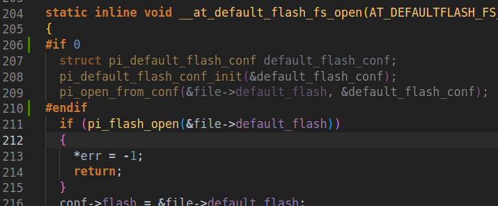

# ECO4AI Dev Doc

## REPO
- **eco4ai_collision**: quantize and run onnx model on Crazyflie with camera capture and wifi transfer (image and inference output)
- **gvsoc_test**: run model on gvsoc emulator


## GAP SDK setup

**environment**: Ubuntu 22.04

**Python**: Python 3.8.17

**GAP SDK version**: https://github.com/GreenWaves-Technologies/gap_sdk/commit/3fea306d52ee33f923f2423c5a75d9eb1c07e904

The GAP SDK installation is pretty simple and can be done by following the README from the git repo.

### troubleshooting

Since we are on Ubuntu 22.04 or have some more recent version of GCC/Python, it may have some compilation or python version problems.

- **‘arm9tdmi_write_core_regs’ accessing 64 bytes in a region of size 8**

  - Some warnings are interpreted as error with some gcc flags (GCC 11)

  - To avoid, build the SDK with this command: `CFLAGS="-Wno-stringop-overflow -Wno-misleading-indentation" make sdk`

- **error: storage size of 'default_flash_conf' isn't known**
- Unknown problem but we don't use this functionality in our case, so deactivate problem lines in `tools/autotiler_v3/Emulation/at_api_pmsis.h`



## GAP8 Application

### tree structure

- Project

  - BUILD/
    - binaries...
  - BUILD_MODEL/
    - model.json
    - C_code_gen.c
    - ...
  - models/
    - model.onnx
    - scripts/
      - nntool_script
  - samples/
    - img1
    - img2
    - img...
  - main.c
  - Makefile

### Makefile

makefile for these applications are very specifics so its highly recommended to use an existing Makefile from example or other project.

In the Makefile, you have to specify the model (TRAINED_MODEL) and the quantize script (NNTOOL_SCRIPT) to be used. The other settings should be the same.

### NNTOOL Script
The documentation inside the gap_sdk repository is very detailed about these options. But here is an example of the script currently in use.
```sh
set debug true
show
adjust

fusions --scale8
fusions -a expression_matcher

aquant test/img/* -T -H 200 -W 200 --scheme SQ8 -D 128 -O -1

nodeoption 0 ALLOCATE 1
imageformat input_1 bw8 offset_int8

show

# CACHE/RAM/FLASH Settings
set l1_size 60000
set l3_ram_device $(MODEL_L3_RAM)
set l3_flash_device $(MODEL_L3_FLASH)
set graph_const_exec_from_flash false

# DEBUG OPTIONS
set graph_produce_node_names true
set graph_produce_operinfos true
set graph_dump_one_node S19_Conv2d_16x16x3x3_Relu
set graph_dump_tensor 6
set graph_trace_exec true
save_state

```

#### known problems
- At the begining, we used the option `set input_norm_func "x:x/128-1"` to noramlize image from [0:255] to [-128:127]. But apparently this option use unsigned numbers so it is impossible to use it. Instead we use [INPUT_OPTIONS] of the aquant command `-D 128 -O -1` which is the same as doing `set input_norm_func "x:x/128-1"`.

- MaxPool Layers don't seem to be working at the moment. After each MaxPool layer, the intermediate data between layers are not what is excepted.
- Some combination of `InFeatures` and `OutFeatures` can generate a wrong value of argument `InFeatures` in the file `modelKernels.c` for some layers. Currently we have to change the value by hand after code generation.

### Build application

```sh
make clean model build image flash|run platform=gvsoc|board
- model: quantize the model and gen C code
- build: build the project
- image generate binaries to flash/run
- flash: flash board or emulator
- run: run program
- platform: choose between gvsoc (emulator) or gap8
```

### Half Inference in the auto generated code

Once the inference code has been generated, it needs to be modified slightly. The file to edit is `BUILD_MODEL/modelKernels.c`. In this code, the `modelCNN(...)` function executes each layer one after the other, so we need to be able to stop the inference after each layer corresponding to a cutting point.

Here's an example of how we've done this in our use case. By adding a parameter to this function enabling inference to be stopped at the desired cutting point.


```c
/**
 * file: BUILD_MODEL/modelKernels.c BUILD_MODEL
 **/

int e4a_collisionCNN(
		unsigned char * __restrict__ Input_1,
		signed char * __restrict__ Output_1,
		uint8_t cp)

{	

	S1_Op_input_1_formatter(
		((unsigned char * __restrict__) Input_1), /* In */
		((signed char * __restrict__) (e4a_collision_L2_Memory_Dyn+0)) /* Out */
	);

	if(cp == 0)
		return cp;

	S4_Conv2d_4x1x5x5_Relu(
		((signed char * __restrict__) (e4a_collision_L2_Memory_Dyn+0)), /* In */
		((signed char * __restrict__) (e4a_collision_L2_Memory+6768)), /* Filter */
		((signed int * __restrict__) (e4a_collision_L2_Memory+7252)), /* Bias */
		((signed char * __restrict__) (e4a_collision_L2_Memory_Dyn+40000)), /* Out */
		((unsigned char * __restrict__) (e4a_collision_L2_Memory+7508)), /* Scale */
		((signed char * __restrict__) (e4a_collision_L2_Memory+7512)), /* ScaleN */
		((signed char * __restrict__) (e4a_collision_L2_Memory+7268)) /* Infos */
	);

	if(cp == 1)
		return cp;

  ...

}
```

Then it's important that your code calling this function is able to retreive the intermediate outputs. Fortunately, the code generated tells us at what offset in L2 the output of each layer is located by means of the comment `... /* Out */` next to the parameter passed to the layer in the function above.

We've done this using the following structure initialised in the code calling the inference.

```c
/**
 * file: e4a_collision.c
 **/
tensor inter_info[] = {
    { .name="NO",  .c=1,  .h=200, .w=200, .offset=0     }, // 0: NO
    { .name="S4",  .c=4,  .h=100, .w=100, .offset=40000 }, // 1: S4
    { .name="S7",  .c=4,  .h=100, .w=100, .offset=0     }, // 2: S7
    { .name="S10", .c=8,  .h=50,  .w=50,  .offset=40000 }, // 3: S10
    { .name="S13", .c=8,  .h=50,  .w=50,  .offset=0     }, // 4: S13 
    { .name="S16", .c=16, .h=25,  .w=25,  .offset=20000 }, // 5: S16
    { .name="S19", .c=16, .h=25,  .w=25,  .offset=64    }, // 6: S19
    { .name="S22", .c=1,  .h=1,   .w=64,  .offset=0     }, // 7: S22
    { .name="ALL", .c=1,  .h=1,   .w=1,   .offset=0     }  // 8: ALL
};
```